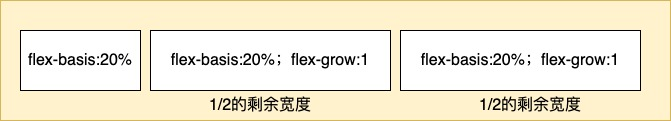
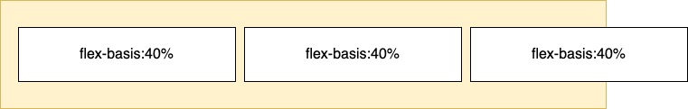
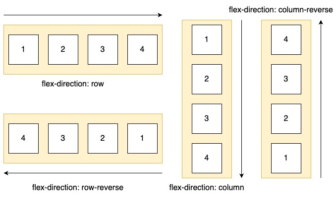

# Flex布局

定义： 给元素添加display:flex，这个元素就变成了一个弹性容器(flex container)，它的直接元素变成了弹性子元素(flex item),弹性子元素在同一行上默认从左向右并排排列，弹性容器可以像块元素一样填满可用宽度，但是弹性子元素不一定能够填满弹性容器的宽度。弹性子元素高度相等，由它们最高的盒子或者内容决定，这个弹性容器的布局就是Flex布局。在弹性容器的内部有两条轴，一个是主轴，一个是副轴。子元素按照主轴方向进行排列，主轴默认的方向为主起点（左）到主终点（右）垂直于主轴的是副轴，副轴默认的方向为副起点（上）到副终点（下）。

##  弹性子元素大小

比起直接设置弹性盒子的margin、width、height这些常见的属性，Flexbox提供了一个更有用的属性：flex。flex属性控制弹性子元素在主轴方向上的大小（这里主要指宽度）。flex属性是由三个不同大小的属性的简写：flex-grow、flex-shrink、flex-basis。

### 使用flex-basis属性

Flex-basis定义了元素大小的基准值，是一个初始的“主尺寸”，它可以被设置为任意值(决定子元素宽度的)，如px、rem、em、百分比等。它的初始值为auto，浏览器会检查元素是否设置了width属性值，如果有，使用width值作为flex-basis的值，如果没有，则用元素内容自身的大小。

### 使用flex-grow属性

每个弹性子元素的flex-basis属性值计算出来后，再加上它们之间的外边距可能会没有填满弹性容器的高度，可能会有空白，多出来的空白会按照flex-grow的值分配给每个弹性子元素。

Flex-grow的值越大，元素的“权重”越高，也就会占据更大的宽度。每个弹性子元素的flex-grow的份额加起来会占据整个剩余空间的大小，剩余空间的大小会根据每个弹性子元素的flex-grow属性分配相应的份额大小，份额越大，占据的空间就会越大，但是不会超过剩余空间的大小。

### 使用flex-shrink属性

flex-shrink属性与flex-grow属性相似，如果不使用这个属性可能会导致溢出。每个子元素的flex-shrink值代表了它是否应该收缩以防止溢出。如果某个子元素为flex-shrink:0，则不会收缩；如果值大于0，则会收缩至不再溢出。

# 弹性方向

flex的主副轴可以进行切换，这个时候用到的是flex-direction属性，它的初始值为row,还有row-reverse, column, column-reverse。效果如下：

## 其他的常用弹性容器属性

flex-wrap：指定了弹性子元素是否会在弹性容器内换行显示，nowrap不换行，wrap换行，wrap-reverse即wrap相反方向换行

justify-content: 控制元素在主轴上的位置；flex-start, flex-end,center,space-between,space-around

align-items:控制元素在副轴上的位置；flex-start, flex-end,center,stretch,baseline

align-content:开启了flex-wrap，align-content就会控制弹性子元素在副轴上的间距，如果子元素没有换行，就会忽略这个属性；flex-start，flex-end,center,stretch,space-between,space-around

## 其他的常用的弹性子元素属性

flex-grow、flex-shrink、flex-basis、flex: 上文说过了

align-self: 控制子元素在副轴上的对齐方式；auto,flex-start, flex-end,center,stretch

order:将弹性子元素从兄弟节点中移动到指定的位置，会覆盖默认的顺序
