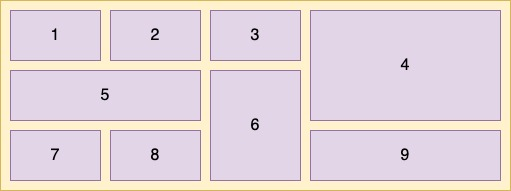
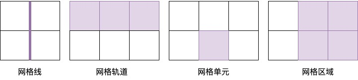
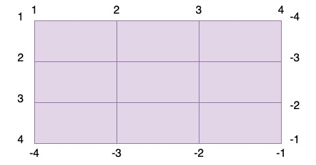
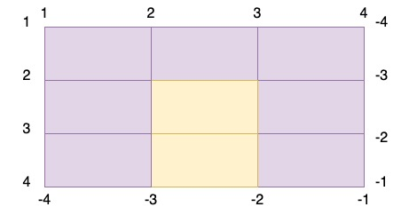
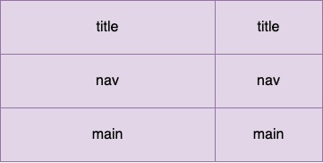

# Grid布局

Grid布局可以定义由行和列组成的二维布局，然后将元素放入网格中。有的元素可能只占据网格的一个单元，有的元素则可能占据多行或者多列。如下图：



这样的布局用flex布局是没有办法实现的，这就体现了网格布局的优势了。

## 构建一个基础的网格布局

```css
		<style>
      .grid {
          display:  grid; //定义一个网格容器
          grid-template-columns: 1fr 1fr 1fr;
          grid-template-rows: 1fr;
          grid-gap: .5em;
      }
		</style>
		<div class="grid">
        <div class="a">a</div>
        <div class="b">b</div>
        <div class="c">c</div>
    </div>
```

使用display: grid定义一个网格容器，容器会表现得像一个块级元素，100%填充可用宽度。grid-template-columns和grid-template-rows分别定义了网格每行每列的大小，这里使用的新单位fr,代表每一列（或每一行）的分数单位，这个单位跟FlexBox中的flex-grow因子表现得一样，grid-template-columns: 1fr 1fr 1fr 表示三列等宽。

## 网格剖析

网格的组成部分如下：

网格线（grid line）:网格的框架，一条网格线可以是垂直的也可以是平行的，如果指定了grid-gap，那么它就在网格线上

网格轨道（grid track）:一个网格轨道是两条相邻网格线之间的空间，可以是水平轨道也可以是垂直轨道

网格单元（grid cell）:网格上的单个空间，水平和垂直的网格轨道交叉重叠的部分

网格区域（grid area）:网格上的矩形区域，由一个或者多个网格单元组成，该区域位于两条垂直网格线和两条水平网格线之间



###  repeat()函数

用repeat()符号可以定义不同的重复模式，如repeat(3,2fr,1fr)会重复三遍这个模式，从而定义六个网格轨道，重复的结果是2fr 1fr 2fr 1fr 2fr 1fr。如下图:

方法定义重复模式.jpg)

### 网格线的编号

网格轨道定义好之后，要将每个网格元素放到特定的位置上。浏览器给网格里的每个网格线都赋予了编号。如下图所示：



## 指定网格元素位置

### 使用编号的网格线确定元素位置

可以在grid-column和grid-row属性中用网格线的编号指定网格元素的位置。grid-column是grid-column-start和grid-column-end的简写；grid-row是grid-row-start和grid-row-end的简写，这两个属性指定一个区域。下图这个黄色的区域为grid-column:2/3;grid-row:2/4；中间的斜线只在简写属性里用于区分两个值，斜线前后的空格不做要求。



### 使用命名的网格线确定元素位置

为了在处理有很多网格轨道时能简单点，可以给网格线命名，并在布局的时候使用网格线而不是编号。声明网格轨道时，可以在中括号内写上网格线的名称，如下：

grid-template-columns: [start]  2fr  [center] 1fr [end];

这条声明定义了两列的网格，三条垂直的网格线分别叫做start、center、end,之后定义网格元素在网格中的位置的时候可以不用编号而是用这些声明来命名，如下代码：

grid-column: start / center;

### 使用网格区域确定元素位置

更简单粗暴的方式是直接用命名的网格区域讲元素定位到网格中，实现这一方法需要借助网格容器的grid-template属性和网格元素的grid-area属性



上面这个网格布局需要用下面的样式来定义，元素内部就用grid-area来指定内部区域。

```css
display: grid;
grid-template-areas: "title title"
		 "nav   nav"
		 "main  main";
grid-template-columns: 2fr 1fr;
grid-template-rows: repeat(3,auto);
```

